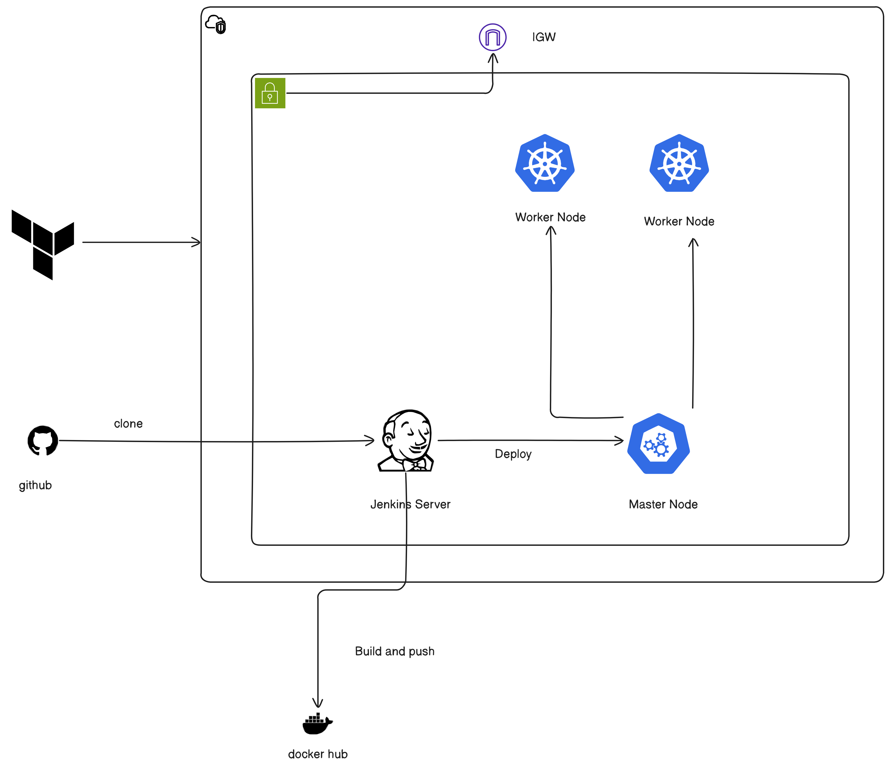
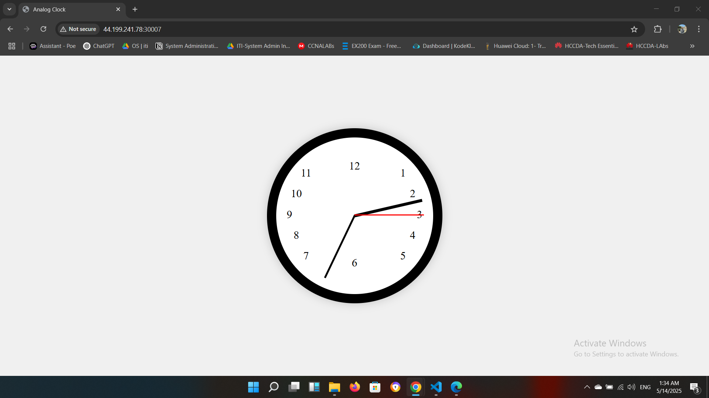

# CICDProject
# 🕒 Analog Clock CI/CD Project

This project demonstrates a complete CI/CD pipeline to deploy a simple Analog Clock web application using:

- **Terraform** for infrastructure provisioning (Jenkins server, Kubernetes cluster)
- **Jenkins** for Continuous Integration and Deployment
- **Docker** for containerization
- **Docker Hub** as the container registry
- **Kubernetes** (Master & Worker nodes) for deployment and orchestration

---

## 📸 Architecture Diagram



---

## 🌍 Live Demo

- **URL**: [http://WorkerIP:30007](http://WorkerIP:30007)

---

## 🔧 Features

- Infrastructure as Code (IaC) using Terraform  
- Jenkins automates:
  - Pulling source code from GitHub  
  - Building Docker images  
  - Pushing to Docker Hub  
  - Deploying to Kubernetes  
- Dockerized frontend  
- Kubernetes Deployment and NodePort Service  

---

## 📁 Folder Structure

```
analog-clock-cicd/
│
├── app/                  # Analog Clock web application source code
│   ├── index.html
│   └── clock.js
│
├── Dockerfile        # Dockerfile for building the app image
│   
│
├── Jenkinsfile       # Jenkins pipeline script
│    
│
├── service.yaml      # K8s Service manifest
|   deployment.yaml   # K8s Deployment manifest
│
├── terraform/
│   ├── main.tf                 # Main Terraform config
│   ├── network.tf              # VPC and networking
│   ├── jenkinsServer.tf        # Jenkins EC2 provisioning
|   |── K8s.tf                  # Jenkins EC2 provisioning
│   ├── security.tf             # Secutity Groups
│   ├── terraform.tfvars        # Variables values
|   |── variables.tf            # Terraform variables
│   └── installTools            # script for install tools on Infrastructure
│
├── diagram.png           # CI/CD architecture image
├── Result.png            # Web App screenshot
└── README.md             # Project documentation
```

---

## ⚙️ Setup & Deployment Steps

### Step 1: Provision Infrastructure (Terraform)

```bash
cd terraform
terraform init
terraform apply
```

This creates:
- VPC  
- Public/private subnets  
- Internet Gateway  
- Security groups  
- EC2 instance (Jenkins)  
- Kubernetes cluster (Master & Worker nodes)  

---

### Step 2: Set Up Jenkins

- Access Jenkins via public IP  
- Install Plugins:
  - GitHub  
  - Docker Pipeline  
  - Kubernetes CLI  
- Add credentials for:
  - GitHub repo access  
  - Docker Hub push  

---

### Step 3: Configure Jenkins Pipeline

Use the `Jenkinsfile` under `/jenkins` to set up the pipeline with the following stages:

- Checkout from GitHub  
- Build Docker image  
- Push to Docker Hub  
- Deploy on Kubernetes  

---

### Step 4: Docker Commands

```bash
docker build -t myDockerHub/cicdproject:latest
docker push  myDockerHub/cicdproject:latest
```

---

### Step 5: Deploy to Kubernetes

```bash
kubectl apply -f deployment.yaml
kubectl apply -f service.yaml
```

Access the app via:

```
http://<EC2-IP>:<NodePort>
```

---

## 🖼️ Screenshots

### Web Application Interface



---

## 💻 Technologies Used

- **AWS EC2, VPC, Security Groups, IGW**  
- **Terraform**  
- **Jenkins**  
- **Docker & Docker Hub**  
- **Kubernetes**  
- **GitHub**  

---

## 👨‍💻 Author

**Mohamed Osama Hassan**  
System Administrator & DevOps


